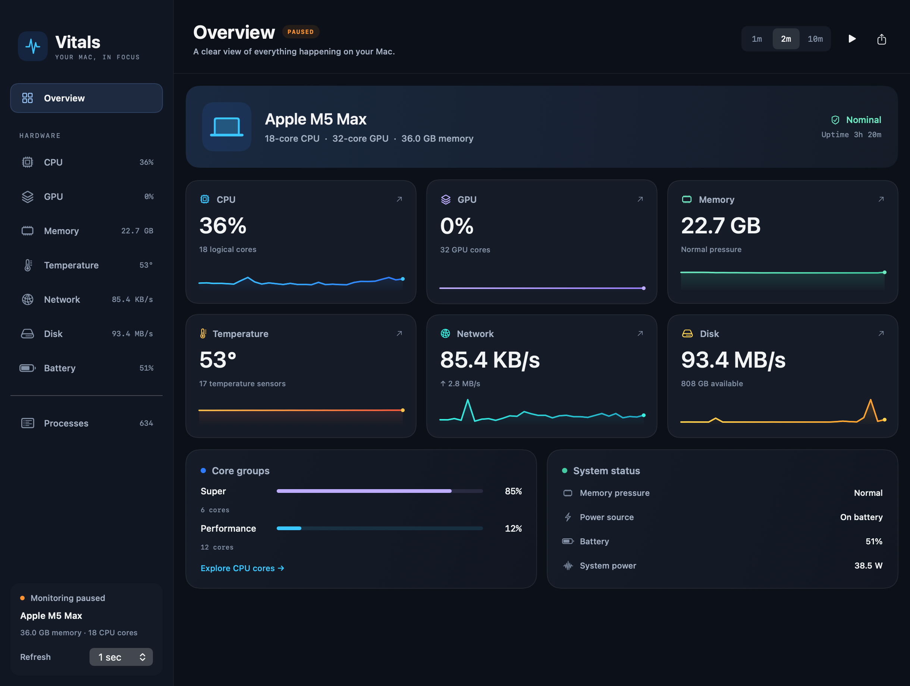
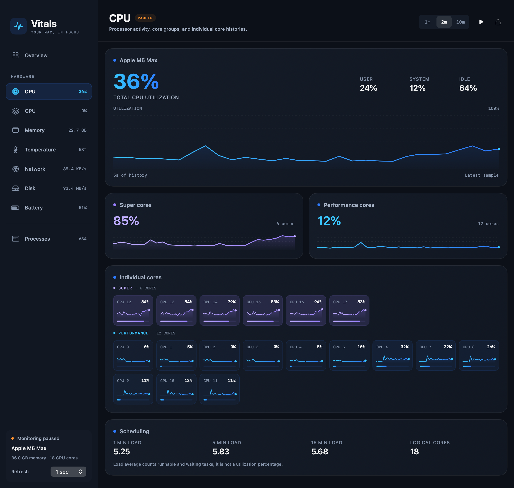

# Vitals

A native macOS resource monitor built with SwiftUI. A live overview, detailed CPU and GPU activity, memory, thermals, network, storage, battery health, and a searchable process list.



## What’s included

- **Overview:** live metric cards, hardware summary, core-group activity, uptime, power source, and thermal / memory pressure status. Click a card to explore it.
- **CPU:** total and individual logical-core utilization, individual core histories, separate Super / Performance / Efficiency groups when verified, user / system / idle breakdown, and 1 / 5 / 15 minute load averages.
- **GPU:** detected hardware core count, device / renderer / tiler utilization, shared-memory allocations, and available sensors. Individual GPU-core utilization is **not exposed by the driver**; Vitals does not fabricate per-core activity.
- **Memory:** app, wired, compressed, cached, and swap usage, plus the operating system’s Normal / Warning / Critical pressure status.
- **Thermals:** temperature sensors, fan speeds, macOS thermal state, and known SMC power rails where available. Read-only; no fan control or power-setting changes.
- **Network:** 64-bit interface counters, download / upload histories, interface lifetime totals, and individual interface activity. Main totals include active `en*` Ethernet / Wi-Fi interfaces; virtual and peer-to-peer interfaces are displayed separately to avoid counting the same traffic twice.
- **Storage:** physical-device read / write throughput, total I/O, and boot-volume capacity. Available capacity includes space macOS considers reclaimable for important usage.
- **Battery:** charge, power source, charging status, cycle count, estimated full-charge capacity relative to design capacity, battery power, condition, and remaining time when available.
- **Processes:** search by name or PID; sort by CPU, physical memory footprint, or name. CPU 100% means one fully occupied core; multi-core processes can exceed 100%. Inaccessible processes are counted explicitly. Counters refresh every 2 seconds, or at the chosen sampling interval if slower.
- **Controls:** pause / resume (`⌘⇧P`), 1 / 2 / 10 minute history views, hover values on utilization charts, clear history, JSON snapshot export, and CSV history export. Sampling interval persists across launches (0.5 / 1 / 2 / 5 seconds).
- **Menu bar:** live CPU, GPU, and temperature readings plus a compact dashboard.



## Download

Download the Apple Silicon app from [GitHub Releases](https://github.com/celiksa/macos-resource-monitor/releases/latest). Requires macOS 14 or later. The app is ad-hoc signed and not notarized. Intel Macs can build from source, but have not been physically verified.

## Build and run

Requires macOS 14+ and Swift 6. No third-party package dependencies. Command Line Tools are sufficient; full Xcode is optional.

```bash
bash scripts/build_app.sh       # release build, app bundle, ad-hoc signature
open Vitals.app

swift run Vitals                # development GUI
swift run Vitals --probe        # one live JSON snapshot
swift run Vitals --probe --watch
swift run Vitals --snapshot /tmp/vitals-shots
swift test
```

The local build is ad-hoc signed, not notarized. Normal monitoring runs without sudo. Some system-owned process counters and hardware sensors may be inaccessible.

## Accuracy and availability

CPU group names come from `hw.perflevelN`; membership comes from IORegistry **logical CPU IDs** and cluster types, checked against the reported core counts. If the mapping cannot be verified, Vitals shows generic logical CPU IDs instead of guessing the core type. Verified on an **M5 Max: 6 Super cores, 12 Performance cores, 32 GPU cores**. Earlier E/P and noncontiguous layouts are covered by fixtures; they have not been physically tested in this workspace.

GPU statistics come from the graphics driver’s IORegistry properties. Metal supplies device identity and unified-memory capability. Renderer and tiler activity overlap and should not be summed. GPU memory uses shared system RAM on Apple Silicon; it is not dedicated VRAM. GPU frequency, per-core GPU loads, and CPU / GPU power are not inferred from utilization.

Memory composition is an approximation from Mach VM counters; pressure is the actual kernel status, not RAM fill percentage. Temperature classifications depend on sensor names, and CPU / SoC temperature is an average of matching sensors. A missing CPU sensor is not replaced by an unrelated hottest sensor. HID temperature, SMC, and several IORegistry interfaces are undocumented and can vary between Macs and OS releases. Missing GPU / temperature / power / battery readings display **—**, and missing chart samples leave gaps.

History is bounded to 1,200 readings (at least 10 minutes at the fastest interval). The visible window is selected by timestamp, and charts reflect actual sample spacing. Pausing freezes the displayed sample; resuming primes delta counters and inserts a gap. JSON exports the current snapshot; CSV exports all retained aggregate history with ISO-8601 timestamps, explicit units in column names, and blank fields for unavailable readings or pause gaps. Data remains local unless you choose to share an export.

## Structure

```
Sources/Vitals/
  App/                 SwiftUI window and menu bar
  Metrics/             Models, sampling engine, export
    Samplers/          Read-only sources and verified CPU topology
  Views/
    Panels/            Overview and eight detail screens
    Components/        Charts, cards, core histories, gauges
    MenuBar/           Compact monitor
  Theme/               Color, typography, and spacing
  CLI/                 JSON probe and panel image renderer
Tests/VitalsTests/     Topology, counters, history, and process CPU verification
```

The sampling engine serializes access to samplers away from the main actor. Visible history is computed once per update. Process enumeration is throttled independently. See [review notes](docs/REVIEW.md) for the changes and validation details.
